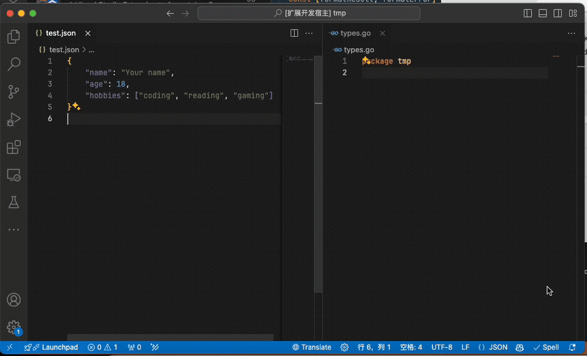

# vscode-transform
VSCode Transform is a VSCode extension that provides a converter collection during coding.

## Usage
Select the text which you want to convert, open the command plate, select the converter you need, the result will be copied to your clipboard, then you can paste it quickly.

    

## Converters
- JSON to GO struct

## Support Us
If you like this project, you can support us in the following ways:
- Give this project a star.
- Share with your friends.
- Open a issue or pull request to request a feature.

## Other extensions you may need to use
- [Typescript JSON Schema generator](https://marketplace.visualstudio.com/items?itemName=marcoq.vscode-typescript-to-json-schema) - Generates a json schema from `TypeScript` type.
- [transform json](https://github.com/raotaohub/vscode-transform) - Generate a `TypesScript` type from json schema.
- [graphql-schema-to-typescript] - Generate a `TypeScript` type from `GraphQL` type
